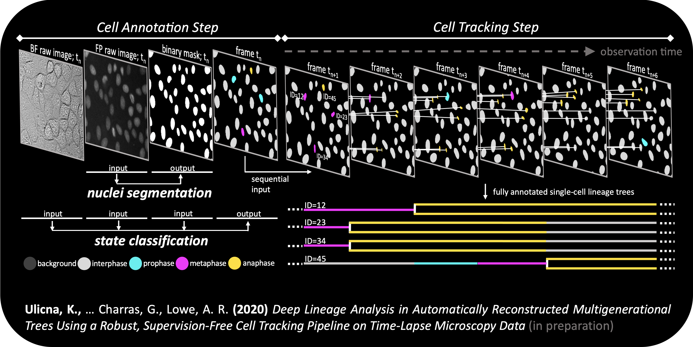

# 🌳 *DeepTree* 🌳

Welcome to my GitHub *DeepTree* repository, where you’ll find various Python packages & Jupyter (iPython) notebooks related to our **latest project publication**:

[Automated deep lineage tree analysis using a Bayesian single cell tracking approach](https://www.biorxiv.org/content/10.1101/2020.09.10.276980v1 "Link to bioRxiv") with the **CellX** team.

Check out my **DeepTree** project poster on [this link](https://github.com/KristinaUlicna/DeepTree/blob/master/DeepTree_Poster.pdf "DeepTree Project Poster") or below:


## PhD Project 👩‍🔬: Heterogeneity within Cell Populations 🧬


**Single Cell Proliferation and Colony Expansion Heterogeneity** -> *Our custom-designed framework consists of deep learning-based cell annotation steps on pairs of transmission and fluorescence time-lapse microscopy images. Low-contrast fluorescence images represent an input to the cell segmentation network built using residual U-Net architecture, which separates individual cell nuclei (white) from background (black) by performing a pixel-wise cell vs. non-cell classification, yielding a binary segmentation masks. Localisation coordinates for each individual cell from the segmentation mask are used to crop an 80 x 80 pixel image glimpse centred around the cell nucleus from both transmission and fluorescence images, which serve as inputs to a convolutional neural network-based classifier to label instantaneous cell state based on cell morphology and nucleic acid condensation level. Labels indicate whether the cell is in interphase (grey), prophase (cyan), metaphase (magenta), anaphase (gold) or undergoes apoptosis (red). A full sequence of fully annotated fields of view capturing the duration of the time-lapse microscopy movies are supplied into the bTrack tracking algorithm, which reconstructs individual cell trajectories & stores the parent-children relationships to be extracted as 2D lineage tree visualisations.*

### Project Status

WORK IN PROGRESS (Last update: 2020/09/16).
_Note: this is not the full repository (yet)_. I am currently restructuring my repo, so please bear with me while I do so. Once completed, you will find my code & supplementary [iPython](https://ipython.org/notebook.html "Jupyter Notebooks") notebooks divided into these sections:

- **tracking_performance:**
   + learn how tracking results can be interpreted on image segmentation masks of low-contrast microscopy images
   + evaluate how well our deep learning & `bTrack` algorithm-based pipeline maintains the identities & trajectories of individual cells over long periods of time
   + visualise which cells can be tracked back to the very beginning of the movie (*survivor*; cyan), which cells migrated into the field of view (*incomer*; yellow), and where track breakage occurred (*mistrack*; red) to quickly identify & correct tracking errors

- **single_cell_lineages:**
   + observe individual cell lineage tree representations from example time-lapse microscopy movie
   + map the intrinsic heterogeneity of the cell cycle durations & colony expansion capacity by individual clones
   + investigate the structure of stored cell segmentation, classification & tracking data by our `bTrack` pipeline

- **lineage_tree_analysis:**
   + visualise the heterogeneity of cell cycling times on large data scales
   + use our massive data repository to understand how cell cycling is descended across multiple downstream generations
   + exploit visibly heritable cycling patterns in extended cell families in automatically reconstructed, multi-generational, deep lineage trees in a **fully unsupervised** manner


### Installation Prerequisites & Dependencies

All code in the *DeepTree* repository is written in Python and has been tested with Python 3.7+ on OS X. Most of the packages require the following additional packages, namely `numpy, scipy, h5py, matplotlib, time, timedate, tqdm, scikit-image`. For convenience, you can just run the following code to install all the dependencies:

`$ pip install -r requirements.txt`

---
### Integration into the Cell Tracking Pipeline

*DeepTree* is a final node of the entire ```Cell Tracking``` pipeline. Interested in learning more? Visit our project [GitHub repository](https://github.com/KristinaUlicna/CellTracking "QuantumJot Cell Tracking GitHub Repository") to learn more about the cell tracking algorithm ```bTrack```, our tracker graphical user interface ```Arboretum``` and much more!

---
### Authors, Acknowledgments & Credits

The code committed to this repository was written by Kristina Ulicna (see the [LICENSE.md](../LICENSE.md "Kristina's LICENSE.md file") for more details) and sources from our custom-designed `CellTracking` library ([CellTracking on Github](https://github.com/quantumjot/CellTracking "Cell Tracking Repository" )), which was developed for microscopy data analysis by Dr Alan R. Lowe at UCL. For more information see our [CellX group website](http://lowe.cs.ucl.ac.uk/cellx.html "CellX group website").

If you are interested to learn more, please -> ⭐ <- the repository & don't hesitate to contact me directly via [email](mailto:kristina.smith.ulicna@gmail.com "Click to Email Me") or my [LinkedIn](https://www.linkedin.com/in/kristinaulicna/ "Kristina's LinkedIn Profile") or [Twitter](https://twitter.com/KristinaUlicna "Kristina's Twitter Profile") profile.

---
### Citation

More details of how this type of single-cell tracking & lineage analysis approach can be applied to tracking cells in time-lapse microscopy data can be found in the following publications:

**Automated deep lineage tree analysis using a Bayesian single cell tracking approach**  
Ulicna K, Vallardi G, Charras G and Lowe AR.  
*bioRxiv* (2020)  
<https://www.biorxiv.org/content/early/2020/09/10/2020.09.10.276980>

```
@article {Ulicna2020.09.10.276980,
  author = {Ulicna, Kristina and Vallardi, Giulia and Charras, Guillaume and Lowe, Alan R.},
  title = {Automated deep lineage tree analysis using a Bayesian single cell tracking approach},
  elocation-id = {2020.09.10.276980},
  year = {2020},
  doi = {10.1101/2020.09.10.276980},
  publisher = {Cold Spring Harbor Laboratory},
  URL = {https://www.biorxiv.org/content/early/2020/09/10/2020.09.10.276980},
  eprint = {https://www.biorxiv.org/content/early/2020/09/10/2020.09.10.276980.full.pdf},
  journal = {bioRxiv}
}
```


