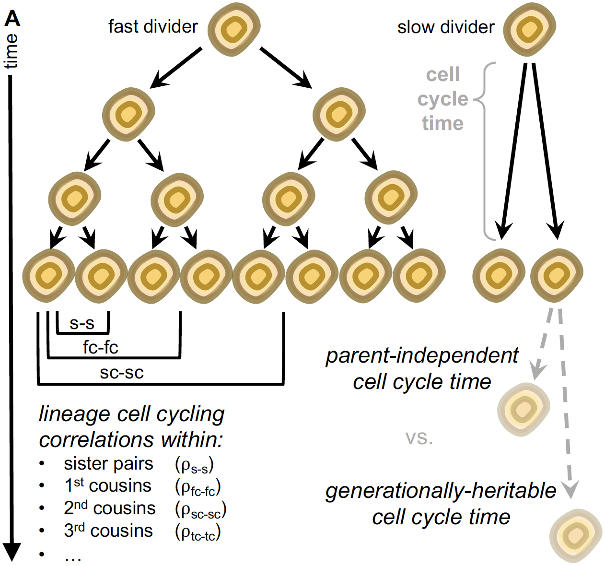

# 🌳 *DeepTree* 🌳

- **lineage_tree_analysis:**
   + visualise the heterogeneity of cell cycling times on large data scales
   + use our massive data repository to understand how cell cycling is descended across multiple downstream generations
   + exploit visibly heritable cycling patterns in extended cell families in automatically reconstructed, multi-generational, deep lineage trees in a **fully unsupervised** manner

**Biological Problem as the Motivation of the Research Study** -> *Cell cycling heterogeneity within single cells is linked to the clone division capacity. An illustration depicts how inherent diversity in cell cycle durations results in populating different progeny size by individual cell clones over identical time period. In this paper, we exploited the cell cycling duration heritability phenomenon, as to whether cells resemble their parents’ cycling durations, and investigated the patterns of cell cycling correlations in large dataset of deep, automatically reconstructed multi-generational lineage trees.*

### Authors, Acknowledgments & Credits

The code committed to this repository was written by Kristina Ulicna (see the [LICENSE.md](../LICENSE.md "Kristina's LICENSE.md file") for more details) and sources from our custom-designed `CellTracking` library ([CellTracking on Github](https://github.com/quantumjot/CellTracking "Cell Tracking Repository" )), which was developed for microscopy data analysis by Dr Alan R. Lowe at UCL. For more information see our [CellX group website](http://lowe.cs.ucl.ac.uk/cellx.html "CellX group website").

If you are interested to learn more, please -> ⭐ <- the repository & don't hesitate to contact me directly via [email](mailto:kristina.smith.ulicna@gmail.com "Click to Email Me") or my [LinkedIn](https://www.linkedin.com/in/kristinaulicna/ "Kristina's LinkedIn Profile") or [Twitter](https://twitter.com/KristinaUlicna "Kristina's Twitter Profile") profile.
